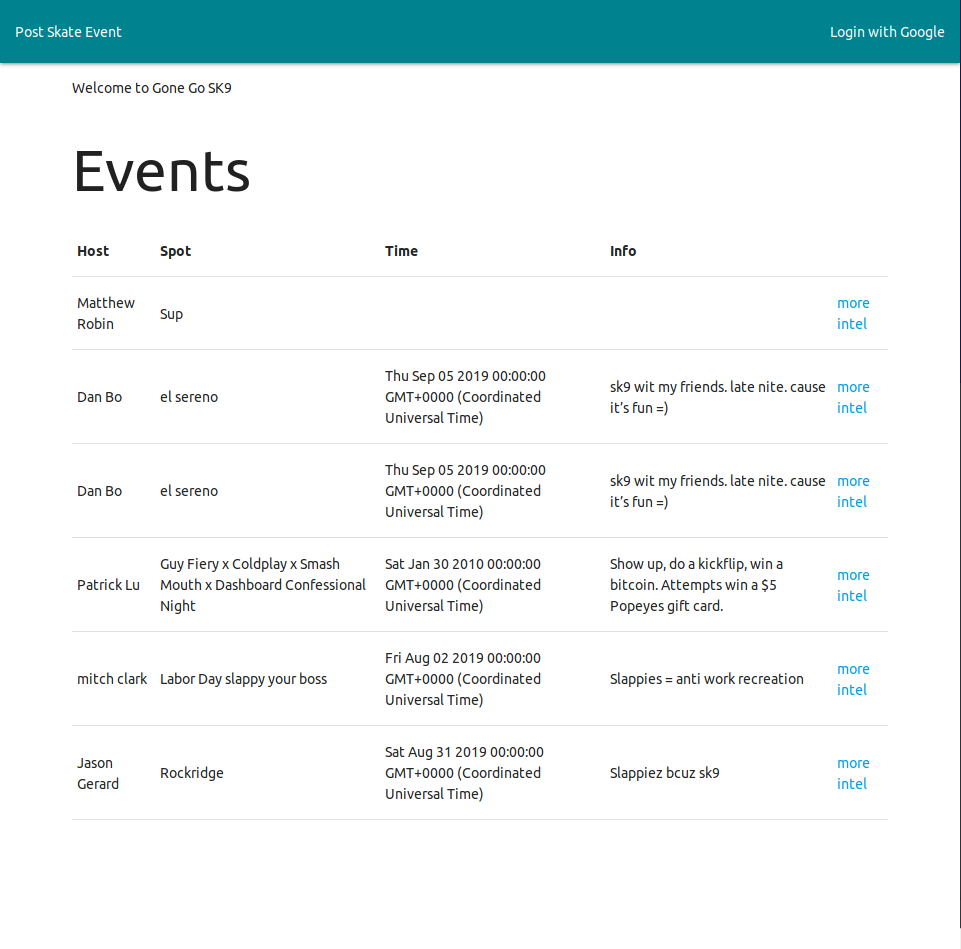
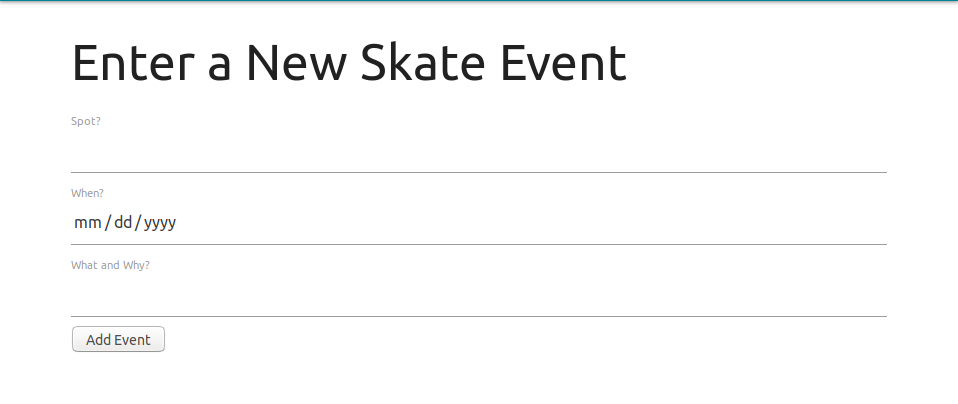
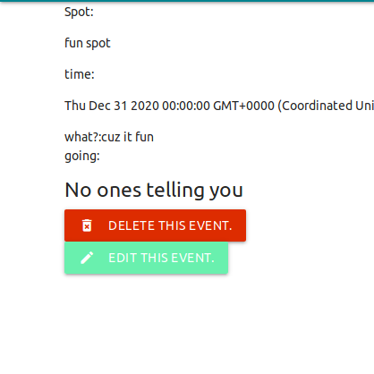

# goneGoSk8

Go Skate is an app that allows friends to post up events and let their friends know where they plan on skating.
use the link and signup then go sk9.
[You can get a link to the app hosted on heroku here](https://gosk9.herokuapp.com)

#Requirements

    Google account
    a modern web browse.

# Screenshots:

# Technologies Used
* HTML
* Javascript
* CSS
* Materalize
* MongoDB
* Express
* OAuth

